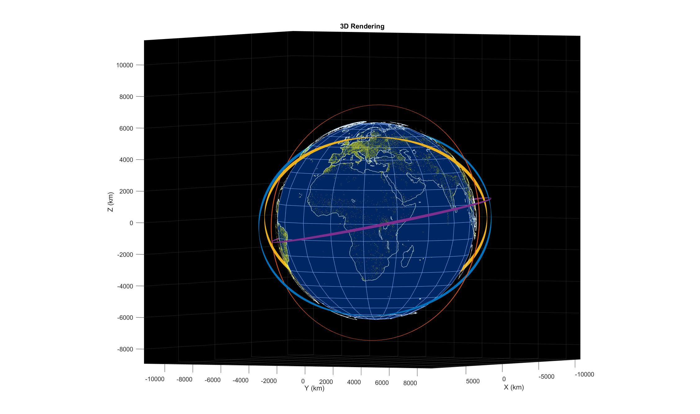

# Orbital-Mechanics-Constellation-Simulation

This project propagates a .json file containing a spacecraft constellation for a full mean solar day while testing line-of-sight of each spacecraft.
The script also creates a 3D plot of the fully propagated constellation orbit with Earth's cities and coastlines.

  
Included functions aid with testing spacecraft line-of-sight, propagating the spacecraft's position and velocity, and loading a .json constellation file. They are included and commented in the Matlab file.
